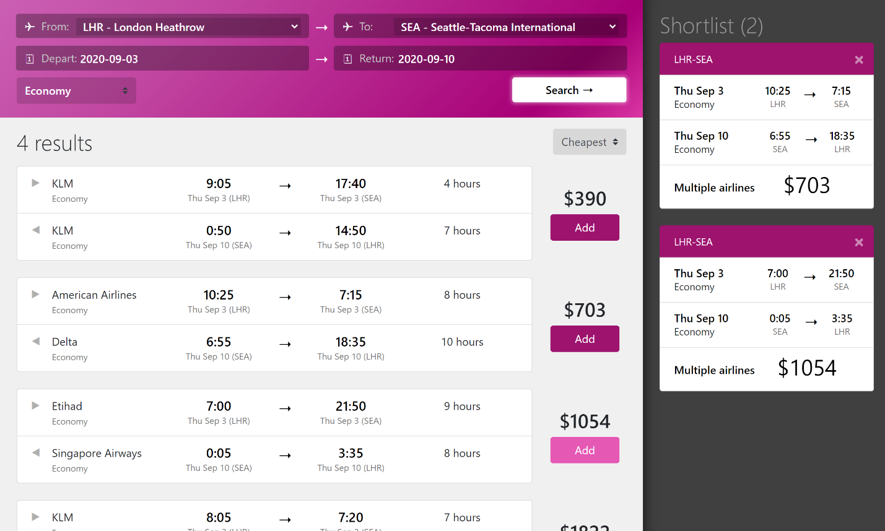
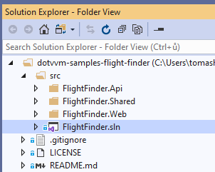
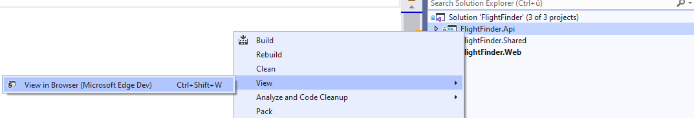
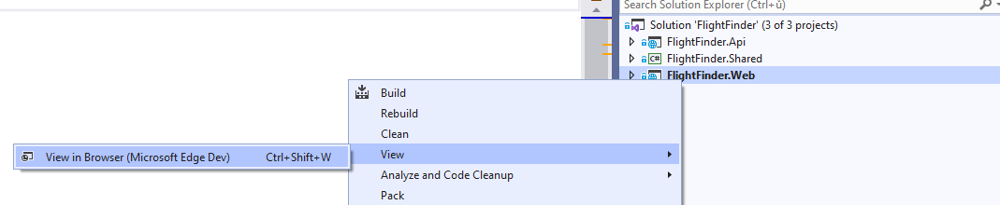

# DotVVM Flight Finder Sample

This application is a [DotVVM](https://github.com/riganti/dotvvm) remake of [Blazor Flight Finder demo](https://github.com/aspnet/samples/tree/master/samples/aspnetcore/blazor). 

## Prerequisites
* Make sure you have installed [DotVVM for Visual Studio](https://www.dotvvm.com/install)

## How to run the sample

1. [Open the GitHub repo in Visual Studio](git-client://clone/?repo=https%3A%2F%2Fgithub.com%2Friganti%2Fdotvvm-samples-flight-finder)
or 
`git clone https://github.com/riganti/dotvvm-samples-flight-finder.git`

2. Open `src/FlightFinder.sln` 

3. Right-click the `FlightFinder.Api` project and select **View > View in Browser**

4. You will see HTTP 404, but it is OK – the `FlightFinder.Api` project is a REST API without a home page – it only provides data to the app itself

5. Right-click `FlightFinder.Web` project and select **View > View in Browser**

## What you can learn in the sample

* How to use [REST API bindings](https://www.dotvvm.com/docs/tutorials/basics-rest-api-bindings/latest) to work with APIs directly from Views
* How to use Markup Controls

---

## Other resources

* [Gitter Chat](https://gitter.im/riganti/dotvvm)
* [DotVVM Official Website](https://www.dotvvm.com)
* [DotVVM Documentation](https://www.dotvvm.com/docs)
* [DotVVM GitHub](https://github.com/riganti/dotvvm)
* [Twitter @dotvvm](https://twitter.com/dotvvm)
* [Samples](https://www.dotvvm.com/samples)

